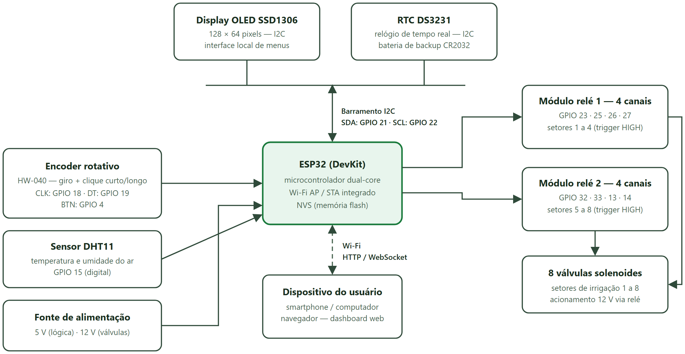
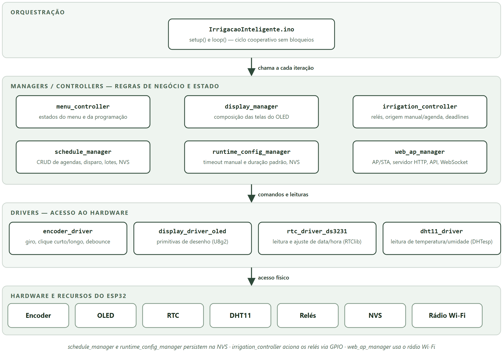
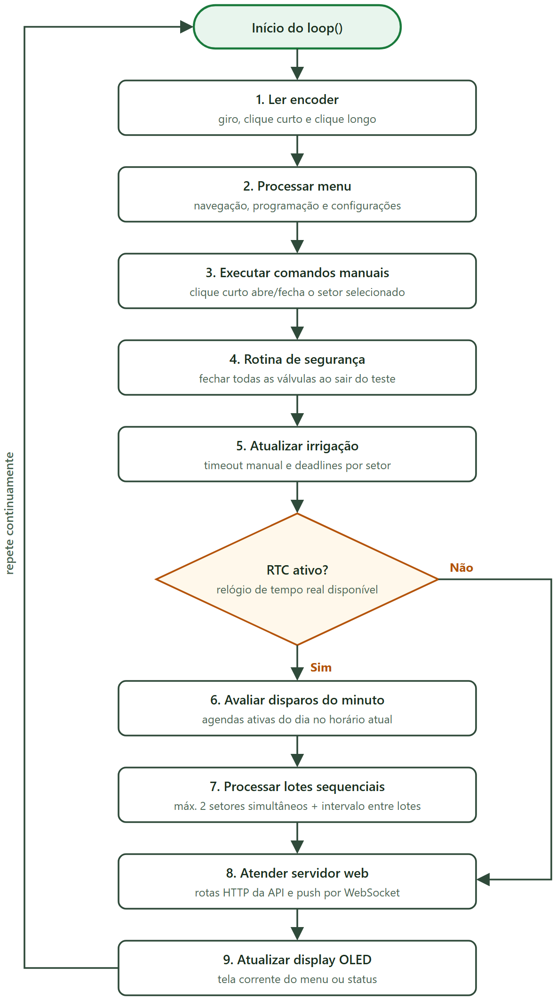
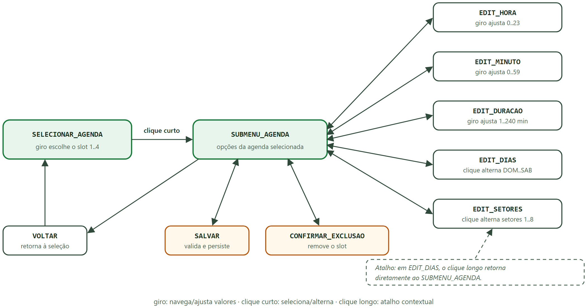
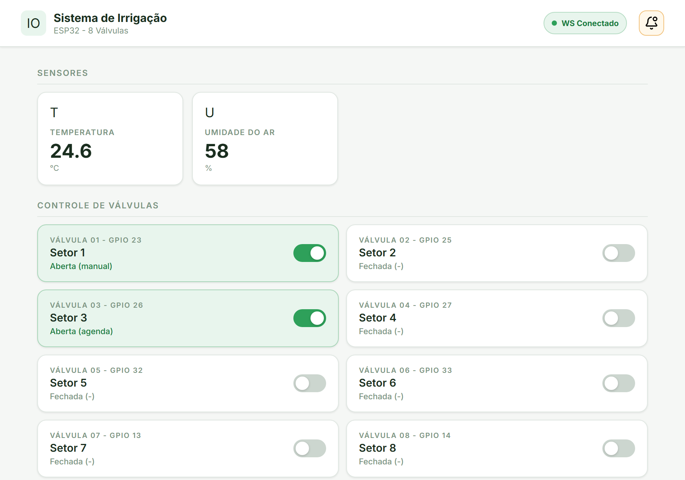
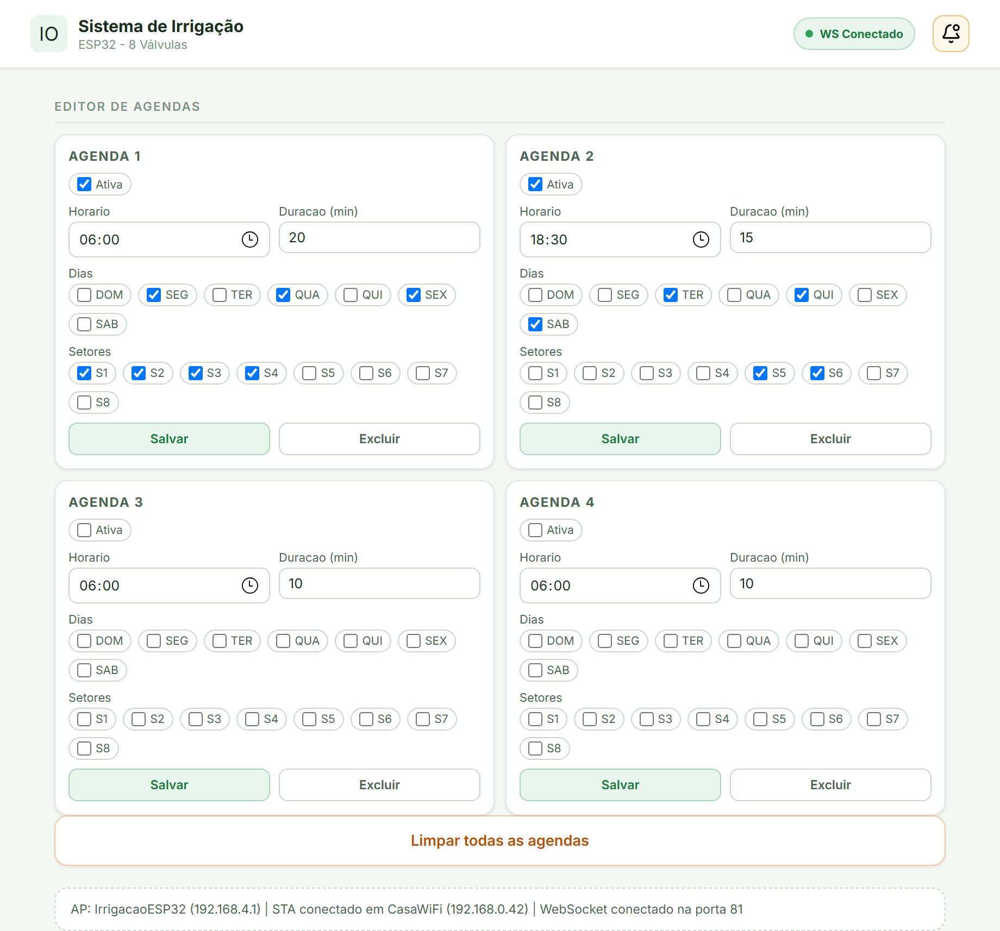
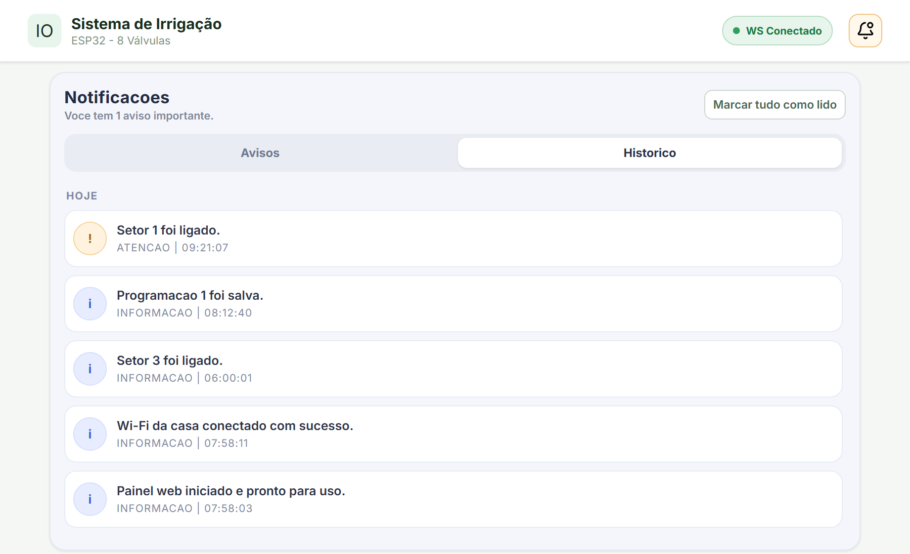

# PROJETO PARA SUBMISSÃO — ESTRUTURA ABNT

> **NOTA DE USO (remover antes da submissão)**
>
> Este documento consolida `README.md`, `GUIA_DIDATICO_PROJETO.md`, `FASE5_CONTRATO_TECNICO.md` e `PLANO_AULAS_12_ENCONTROS.md` na estrutura exigida pelas normas ABNT para trabalhos acadêmicos e submissão de projetos:
>
> - **NBR 14724:2011** — estrutura e apresentação de trabalhos acadêmicos;
> - **NBR 6023:2018** — referências;
> - **NBR 6024:2012** — numeração progressiva das seções;
> - **NBR 6027:2012** — sumário;
> - **NBR 6028:2021** — resumo e abstract;
> - **NBR 10520:2023** — citações.
>
> **Checklist de formatação ao transpor para Word/Google Docs/LaTeX:**
>
> | Item | Especificação ABNT |
> | --- | --- |
> | Papel | A4 (21 cm × 29,7 cm) |
> | Margens | Superior e esquerda: 3 cm; inferior e direita: 2 cm |
> | Fonte | Times New Roman ou Arial, tamanho 12 (corpo); tamanho 10 para citações longas, notas de rodapé, legendas e fontes de ilustrações/tabelas |
> | Espaçamento | 1,5 entre linhas no corpo do texto; simples em citações longas (recuo de 4 cm), notas, referências, legendas, ficha catalográfica |
> | Parágrafo | Recuo de 1,25 cm na primeira linha (padrão usual) |
> | Paginação | Contada a partir da folha de rosto, **impressa** a partir da Introdução, algarismos arábicos no canto superior direito |
> | Seções primárias | Iniciam em página nova, título em MAIÚSCULAS e negrito |
> | Citações diretas > 3 linhas | Recuo de 4 cm, fonte 10, sem aspas, espaçamento simples |
> | Ilustrações e tabelas | Título na parte superior, fonte na parte inferior (ex.: "Fonte: elaborado pelo autor (2026)") |
>
> Os campos entre colchetes `[ ]` devem ser preenchidos com os dados da instituição/autor.

---

## ELEMENTOS PRÉ-TEXTUAIS

### CAPA (obrigatório)

> ASSOCIAÇÃO CONEXÃO SOCIAL
> [CURSO TÉCNICO / PROGRAMA]
>
> WENDERSON FARIAS
>
> **SISTEMA DE IRRIGAÇÃO INTELIGENTE COM ESP32: desenvolvimento de firmware modular com agendamento automático, persistência de dados e supervisão via dashboard web, com aplicação didática no ensino de sistemas embarcados**
>
> LAGOA DE ITAENGA — PE
> 2026

### FOLHA DE ROSTO (obrigatório)

> WENDERSON FARIAS
>
> **SISTEMA DE IRRIGAÇÃO INTELIGENTE COM ESP32: desenvolvimento de firmware modular com agendamento automático, persistência de dados e supervisão via dashboard web, com aplicação didática no ensino de sistemas embarcados**
>
> Projeto apresentado ao [Componente Curricular de Trabalho de Conclusão de Curso] da Associação Conexão Social, como requisito parcial para [conclusão do curso].
>
> Orientadores: Prof. Luanderson Arlindo e Prof. Daniel José
>
> LAGOA DE ITAENGA — PE
> 2026

### FOLHA DE APROVAÇÃO (obrigatório para trabalhos avaliados por banca)

> Wenderson Farias
> Sistema de Irrigação Inteligente com ESP32
>
> Aprovado em: 25/03/2026
>
> BANCA EXAMINADORA
>
> \_\_\_\_\_\_\_\_\_\_\_\_\_\_\_\_\_\_\_\_\_\_\_\_\_\_\_\_\_\_\_\_
> Prof. Luanderson Arlindo — Associação Conexão Social (Orientador)
>
> \_\_\_\_\_\_\_\_\_\_\_\_\_\_\_\_\_\_\_\_\_\_\_\_\_\_\_\_\_\_\_\_
> Prof. Daniel José — Associação Conexão Social (Orientador)
>
> \_\_\_\_\_\_\_\_\_\_\_\_\_\_\_\_\_\_\_\_\_\_\_\_\_\_\_\_\_\_\_\_
> Prof.ª Talitta Ferreira — [Instituição]
>
> \_\_\_\_\_\_\_\_\_\_\_\_\_\_\_\_\_\_\_\_\_\_\_\_\_\_\_\_\_\_\_\_
> Prof.ª Maria Takeshita — [Instituição]
>
> \_\_\_\_\_\_\_\_\_\_\_\_\_\_\_\_\_\_\_\_\_\_\_\_\_\_\_\_\_\_\_\_
> Prof. Orlando da Silva — [Instituição]

### DEDICATÓRIA E AGRADECIMENTOS (opcionais)

> [Dedico este trabalho aos meus pais, pelo apoio constante, e aos professores da Associação Conexão Social, especialmente aos meus orientadores, Prof. Luanderson Arlindo e Prof. Daniel José, pela paciência e pelas orientações que tornaram este projeto possível.]

### RESUMO (obrigatório — NBR 6028)

Este trabalho apresenta o desenvolvimento de um sistema de irrigação inteligente baseado no microcontrolador ESP32, com controle físico de até oito válvulas solenoides por módulos de relé, interface local composta por display OLED, encoder rotativo e sensor DHT11 de temperatura e umidade do ar, e supervisão remota por meio de dashboard web hospedado no próprio dispositivo. O sistema oferece dois modos de operação: irrigação manual por setor, protegida por timeout de segurança configurável, e irrigação automática por agendamento semanal, com até quatro agendas globais que selecionam dias da semana e setores por máscaras de bits. A execução automática é sequencial por lotes, respeitando limite de setores simultâneos e intervalo entre lotes, com retomada de janela ativa após reinicialização. A precisão temporal é garantida por módulo de relógio de tempo real (RTC) DS3231, e a persistência de agendas, configurações de runtime e cache diário de execução é realizada na memória não volátil (NVS) do ESP32, com verificação de integridade por versão e CRC. O firmware foi estruturado em arquitetura modular, separando drivers de hardware, gerenciadores de lógica e orquestração do laço principal, o que favorece a manutenção e o uso pedagógico. Como produto educacional associado, foi elaborado um plano de ensino de doze encontros para estudantes de 14 a 17 anos, fundamentado na aprendizagem baseada em projetos. Os testes funcionais demonstraram o cumprimento dos critérios de aceite definidos em contrato técnico: criação, edição, persistência e disparo correto das agendas; ausência de regressão no modo manual; e resposta íntegra das rotas da API web. Conclui-se que a solução é viável como sistema de automação de baixo custo e como recurso didático para o ensino de sistemas embarcados e Internet das Coisas.

**Palavras-chave:** irrigação automatizada; sistemas embarcados; ESP32; Internet das Coisas; aprendizagem baseada em projetos.

### ABSTRACT (obrigatório quando exigido pela instituição — NBR 6028)

This work presents the development of a smart irrigation system based on the ESP32 microcontroller, with physical control of up to eight solenoid valves through relay modules, a local interface composed of an OLED display, a rotary encoder and a DHT11 temperature and humidity sensor, and remote supervision through a web dashboard hosted on the device itself. The system offers two operating modes: manual irrigation per sector, protected by a configurable safety timeout, and automatic irrigation by weekly scheduling, with up to four global schedules that select days of the week and sectors through bit masks. Automatic execution is sequential by batches, respecting a limit of simultaneous sectors and an interval between batches, with resumption of the active window after reboot. Time accuracy is ensured by a DS3231 real-time clock (RTC) module, and the persistence of schedules, runtime settings and daily execution cache is performed in the ESP32 non-volatile storage (NVS), with integrity verification by version and CRC. The firmware was structured in a modular architecture, separating hardware drivers, logic managers and main-loop orchestration, which favors maintenance and pedagogical use. As an associated educational product, a twelve-meeting teaching plan was designed for students aged 14 to 17, grounded in project-based learning. Functional tests demonstrated compliance with the acceptance criteria defined in the technical contract: creation, editing, persistence and correct triggering of schedules; no regression in manual mode; and consistent responses from the web API routes. It is concluded that the solution is feasible as a low-cost automation system and as a didactic resource for teaching embedded systems and the Internet of Things.

**Keywords:** automated irrigation; embedded systems; ESP32; Internet of Things; project-based learning.

### LISTA DE ILUSTRAÇÕES

- Figura 1 — Diagrama de blocos do hardware do sistema
- Figura 2 — Arquitetura modular do firmware (drivers, managers e orquestração)
- Figura 3 — Fluxograma do laço principal do firmware
- Figura 4 — Máquina de estados da programação de agendas no OLED
- Figura 5 — Capturas do dashboard web (status, válvulas, agendas e eventos)

### LISTA DE TABELAS

- Tabela 1 — Componentes de hardware e função no sistema
- Tabela 2 — Mapeamento de pinos do ESP32
- Tabela 3 — Parâmetros de configuração do firmware
- Tabela 4 — Rotas da API web e finalidade
- Tabela 5 — Critérios de aceite e resultado da validação
- Tabela 6 — Cronograma de execução
- Tabela 7 — Orçamento estimado

### LISTA DE ABREVIATURAS E SIGLAS

| Sigla | Significado |
| --- | --- |
| AP | Access Point (ponto de acesso Wi-Fi) |
| API | Application Programming Interface |
| CRC | Cyclic Redundancy Check (verificação cíclica de redundância) |
| CRUD | Create, Read, Update, Delete |
| DHT | Digital Humidity and Temperature (sensor digital de umidade e temperatura) |
| GPIO | General Purpose Input/Output |
| HTTP | Hypertext Transfer Protocol |
| I2C | Inter-Integrated Circuit (barramento de comunicação serial) |
| IoT | Internet of Things (Internet das Coisas) |
| JSON | JavaScript Object Notation |
| mDNS | Multicast Domain Name System |
| NVS | Non-Volatile Storage (armazenamento não volátil) |
| OLED | Organic Light-Emitting Diode |
| RTC | Real-Time Clock (relógio de tempo real) |
| STA | Station (modo estação Wi-Fi) |
| UX | User Experience (experiência do usuário) |

### SUMÁRIO (NBR 6027)

1. INTRODUÇÃO
   1.1 Contextualização
   1.2 Problema de pesquisa
   1.3 Justificativa
   1.4 Objetivos
   1.4.1 Objetivo geral
   1.4.2 Objetivos específicos
2. FUNDAMENTAÇÃO TEÓRICA
   2.1 Irrigação e automação agrícola
   2.2 Microcontroladores e o ESP32
   2.3 Sistemas embarcados e arquitetura modular de firmware
   2.4 Comunicação I2C e periféricos (OLED e RTC)
   2.5 Persistência em memória não volátil e integridade de dados
   2.6 Internet das Coisas, servidores web embarcados e WebSocket
   2.7 Aprendizagem baseada em projetos no ensino de tecnologia
3. MATERIAIS E MÉTODOS
   3.1 Classificação da pesquisa
   3.2 Materiais
   3.3 Ferramentas de software
   3.4 Método de desenvolvimento
   3.5 Procedimentos de validação
4. DESENVOLVIMENTO DO SISTEMA
   4.1 Arquitetura geral
   4.2 Interface local de operação
   4.3 Controle de irrigação manual
   4.4 Motor de agendamento automático
   4.5 Persistência e integridade de dados
   4.6 Dashboard web e API
   4.7 Produto educacional: plano de ensino
5. RESULTADOS E DISCUSSÃO
   5.1 Resultados funcionais
   5.2 Discussão
   5.3 Limitações
6. CRONOGRAMA
7. ORÇAMENTO ESTIMADO
8. CONSIDERAÇÕES FINAIS
   REFERÊNCIAS
   APÊNDICE A — Mapeamento de pinos e parâmetros de configuração
   APÊNDICE B — Contrato técnico do módulo de agendamento (Fase 5)
   APÊNDICE C — Plano de aulas em 12 encontros
   APÊNDICE D — Rotas da API web
   ANEXO A — Documentação técnica dos componentes (datasheets)

---

## ELEMENTOS TEXTUAIS

# 1 INTRODUÇÃO

## 1.1 Contextualização

A água é um recurso natural finito e a agricultura figura entre as atividades que mais a consomem. O manejo adequado da irrigação — aplicar a quantidade correta de água, no horário correto e no local correto — é determinante tanto para a produtividade quanto para a sustentabilidade hídrica (BERNARDO; SOARES; MANTOVANI, 2006). Em pequenas propriedades, hortas escolares e jardins residenciais, contudo, a irrigação ainda é frequentemente realizada de forma manual, sujeita a esquecimentos, desperdícios e irregularidade.

O avanço dos microcontroladores de baixo custo com conectividade sem fio, como o ESP32 (ESPRESSIF SYSTEMS, 2023), viabiliza soluções de automação acessíveis, capazes de acionar válvulas em horários programados, manter a programação mesmo após quedas de energia e oferecer supervisão remota por rede Wi-Fi local. Paralelamente, projetos dessa natureza constituem recurso pedagógico rico para o ensino de eletrônica, programação e Internet das Coisas na educação básica e técnica, em consonância com a aprendizagem baseada em projetos (BENDER, 2014).

## 1.2 Problema de pesquisa

Como desenvolver um sistema de irrigação automatizado, de baixo custo, que combine operação local confiável, agendamento semanal persistente e supervisão remota, e que simultaneamente sirva como objeto de aprendizagem estruturado para estudantes de nível básico e técnico?

## 1.3 Justificativa

O projeto justifica-se em três dimensões:

a) **técnica** — demonstra a viabilidade de um controlador de irrigação completo (oito setores, agendamento semanal, persistência com verificação de integridade e API web) construído inteiramente com componentes de prateleira e software livre;

b) **socioambiental** — o acionamento automatizado em horários adequados e os mecanismos de segurança (timeout do modo manual e fechamento de válvulas ao sair do modo de teste) reduzem o desperdício de água decorrente de esquecimento ou falha de operação;

c) **educacional** — a arquitetura modular do firmware foi deliberadamente organizada para o ensino: cada módulo resolve um problema específico e isolável, permitindo que o sistema seja estudado em doze encontros progressivos, do conceito de microcontrolador até a depuração de um sistema integrado.

## 1.4 Objetivos

### 1.4.1 Objetivo geral

Desenvolver e validar um sistema embarcado de irrigação inteligente baseado em ESP32, com controle manual e automático de até oito setores, persistência de configurações e supervisão via dashboard web, estruturado como recurso didático para o ensino de sistemas embarcados.

### 1.4.2 Objetivos específicos

a) projetar a integração de hardware entre ESP32, display OLED SSD1306, encoder rotativo, RTC DS3231, sensor DHT11 e dois módulos de relé de quatro canais;

b) implementar firmware modular com separação entre drivers de hardware, gerenciadores de lógica e orquestração do laço principal;

c) implementar irrigação manual por setor com timeout de segurança configurável em tempo de execução;

d) implementar motor de agendamento semanal com até quatro agendas globais, seleção de dias e setores por máscara de bits, execução sequencial por lotes e retomada de janela ativa;

e) garantir a persistência de agendas, configurações de runtime e cache diário de execução na NVS, com validação por versão e CRC;

f) disponibilizar dashboard web local com API REST para status, comando de válvulas, gestão de agendas, ajuste de RTC e histórico de eventos, com atualização em tempo real por WebSocket;

g) elaborar plano de ensino de doze encontros baseado no sistema, destinado a estudantes de 14 a 17 anos;

h) validar o sistema segundo os critérios de aceite definidos em contrato técnico.

# 2 FUNDAMENTAÇÃO TEÓRICA

## 2.1 Irrigação e automação agrícola

A irrigação consiste na aplicação artificial de água ao solo visando suprir a demanda hídrica das culturas (BERNARDO; SOARES; MANTOVANI, 2006). Sistemas automatizados de irrigação substituem a intervenção humana no acionamento por mecanismos de decisão baseados em tempo (agendas) ou em sensores (umidade do solo, clima). Este trabalho adota o modelo baseado em tempo com relógio de precisão, apropriado para hortas e jardins de pequeno porte, mantendo a evolução para sensores como trabalho futuro.

## 2.2 Microcontroladores e o ESP32

Microcontroladores são circuitos integrados que reúnem processador, memória e periféricos de entrada e saída, dedicados a tarefas específicas de controle (MONK, 2017; McROBERTS, 2015). O ESP32, da Espressif Systems, destaca-se pelo processador dual-core, conectividade Wi-Fi e Bluetooth integradas, memória flash com partição de armazenamento não volátil (NVS) e ampla disponibilidade de GPIOs (ESPRESSIF SYSTEMS, 2023), características que o tornam adequado a aplicações de IoT de baixo custo. A programação por meio do ambiente Arduino (ARDUINO, 2026) reduz a barreira de entrada, o que é relevante para o objetivo pedagógico deste projeto.

## 2.3 Sistemas embarcados e arquitetura modular de firmware

Firmware embarcado de qualidade requer organização que favoreça manutenção, teste e evolução. Este projeto adota separação em três camadas: **drivers**, que encapsulam o acesso ao hardware (encoder, display, RTC); **managers/controllers**, que concentram regras de negócio e estado (menu, agendamento, irrigação, configuração de runtime, servidor web); e o arquivo principal, que orquestra inicialização e laço principal. O laço é cooperativo e não bloqueante — sem `delay()` longos — para manter a responsividade simultânea da interface local, do motor de agendas e do servidor HTTP.

## 2.4 Comunicação I2C e periféricos (OLED e RTC)

O barramento I2C permite conectar múltiplos dispositivos com apenas duas linhas (SDA e SCL), cada qual com endereço próprio. No sistema, o display OLED SSD1306 e o RTC DS3231 compartilham o mesmo barramento. O DS3231 é um relógio de tempo real com oscilador compensado por temperatura, com precisão adequada para agendamento e bateria de backup que mantém a hora na ausência de alimentação principal (ANALOG DEVICES, 2015).

## 2.5 Persistência em memória não volátil e integridade de dados

A NVS do ESP32 permite gravar pares chave-valor na memória flash, preservando dados após desligamento. Como escritas em flash têm ciclo de vida limitado e podem ser corrompidas por falhas de energia, o projeto aplica duas salvaguardas: gravação apenas quando há alteração relevante e validação por número de versão e CRC em cada bloco persistido. Blocos inválidos no boot são reinicializados para um padrão seguro.

## 2.6 Internet das Coisas, servidores web embarcados e WebSocket

A Internet das Coisas caracteriza-se pela conexão de objetos físicos a redes de comunicação para monitoramento e controle. O ESP32 pode atuar simultaneamente como ponto de acesso (AP) — criando rede Wi-Fi própria — e como estação (STA) conectada a um roteador existente. Sobre essa conectividade, o firmware hospeda servidor HTTP com API REST que responde em JSON e um canal WebSocket (LINKS2004, 2026) para publicação de status em tempo real, com fallback para polling HTTP. O protocolo mDNS permite acesso por nome amigável (`http://irrigacaoesp32.local/`) sem conhecimento do endereço IP.

## 2.7 Aprendizagem baseada em projetos no ensino de tecnologia

A aprendizagem baseada em projetos organiza o ensino em torno de um problema real e de um produto concreto, promovendo protagonismo, trabalho em equipe e integração de saberes (BENDER, 2014). O sistema de irrigação constitui âncora ideal para esse método: envolve eletricidade básica, eletrônica, programação, redes e experiência do usuário, e produz resultado observável (a válvula abre no horário programado), o que realimenta a motivação dos estudantes.

# 3 MATERIAIS E MÉTODOS

## 3.1 Classificação da pesquisa

Trata-se de pesquisa aplicada, de natureza tecnológica e abordagem qualitativa-experimental, orientada ao desenvolvimento e validação funcional de um artefato (sistema embarcado) e de um produto educacional associado (plano de ensino).

## 3.2 Materiais

Tabela 1 — Componentes de hardware e função no sistema

| Componente | Quantidade | Função |
| --- | --- | --- |
| Placa de desenvolvimento ESP32 | 1 | Unidade central de processamento e conectividade Wi-Fi |
| Display OLED SSD1306 128×64 (I2C) | 1 | Interface visual local (menus e status) |
| Encoder rotativo com botão (HW-040 ou equivalente) | 1 | Entrada do usuário (navegação e seleção) |
| Módulo RTC DS3231 (I2C) com bateria | 1 | Referência de data e hora para o agendamento |
| Sensor DHT11 (temperatura e umidade do ar) | 1 | Leitura ambiental exibida no menu Sensores e no dashboard |
| Módulo de relé 4 canais (trigger HIGH) | 2 | Acionamento de até 8 válvulas solenoides |
| Válvulas solenoides | até 8 | Controle físico do fluxo de água por setor |
| Fonte de alimentação, protoboard/placa, cabos | — | Alimentação e interconexão |

Fonte: elaborado pelo autor (2026).

## 3.3 Ferramentas de software

a) Arduino IDE com suporte à placa ESP32;
b) bibliotecas: U8g2 (display OLED), RTClib (DS3231), ESP32Encoder (encoder), DHTesp (sensor DHT11) e WebSocketsServer/arduinoWebSockets (tempo real, opcional);
c) linguagem C++ (framework Arduino);
d) controle de versão com Git;
e) monitor serial a 115200 baud para diagnóstico.

## 3.4 Método de desenvolvimento

O desenvolvimento foi conduzido em fases incrementais, cada qual com contrato técnico definindo escopo, modelo de dados, regras funcionais e critérios de aceite (Apêndice B). A fase de agendamento (Fase 5) consolidou as seguintes decisões de produto: agendas globais com seleção de setores por máscara de bits; agendamento semanal por dias da semana; persistência em NVS; limite de quatro slots de agenda; edição integral por encoder; execução sequencial por lotes com limite de simultaneidade; e dashboard com endpoint de alertas e eventos.

A arquitetura do firmware segue a separação descrita na subseção 2.3, com onze módulos: `encoder_driver`, `display_driver_oled`, `rtc_driver_ds3231`, `dht11_driver` (drivers); `runtime_config_manager`, `menu_controller`, `display_manager`, `irrigation_controller`, `schedule_manager`, `web_ap_manager` (gerência e lógica); e `IrrigacaoInteligente.ino` (orquestração).

## 3.5 Procedimentos de validação

A validação funcional seguiu roteiro mínimo definido em documentação do projeto: (1) navegação completa do menu e acionamento manual de setores; (2) verificação do timeout manual; (3) criação de agenda válida; (4) reinicialização e verificação de persistência; (5) simulação de horário e verificação de disparo automático; (6) tentativa de criação de agenda duplicada e confirmação de bloqueio; (7) operação com RTC ausente; (8) exercício de todas as rotas do dashboard web (status, válvulas, agendas, runtime e RTC). Os resultados são confrontados com os critérios de aceite na seção 5.

# 4 DESENVOLVIMENTO DO SISTEMA

## 4.1 Arquitetura geral

O sistema integra três domínios: o **hardware** (ESP32, periféricos I2C, encoder e relés), o **firmware** modular e as **interfaces de operação** (local, via OLED e encoder; remota, via dashboard web). A Figura 1 apresenta o diagrama de blocos do hardware, com as conexões entre o microcontrolador e os periféricos.

Figura 1 — Diagrama de blocos do hardware do sistema

{width=15cm}

Fonte: elaborado pelo autor (2026).

O mapeamento completo de pinos e parâmetros encontra-se no Apêndice A. Destaca-se que OLED e RTC compartilham o barramento I2C (SDA 21, SCL 22) e que os relés operam com acionamento em nível lógico alto. A organização do firmware em camadas — orquestração, gerenciadores de lógica e drivers de hardware — é apresentada na Figura 2.

Figura 2 — Arquitetura modular do firmware (drivers, managers e orquestração)

{width=15cm}

Fonte: elaborado pelo autor (2026).

O laço principal executa, em cada iteração: leitura do encoder; processamento do menu; comandos de irrigação manual; rotina de segurança ao sair do teste de válvulas; atualização de timeouts e deadlines de irrigação; avaliação de disparos de agenda a cada mudança de minuto (RTC); processamento da execução sequencial por lotes; atendimento ao servidor web; e atualização do display. A Figura 3 representa esse ciclo em fluxograma.

Figura 3 — Fluxograma do laço principal do firmware

{width=8.5cm}

Fonte: elaborado pelo autor (2026).

## 4.2 Interface local de operação

O menu principal oferece cinco entradas: **Irrigar Agora**, **Programar**, **WEBSERVER**, **Sensores** e **Configurações**. A tela Sensores exibe a leitura de temperatura e umidade do ar do DHT11, o mesmo dado publicado no dashboard web. O encoder provê três gestos: giro (navegação), clique curto (seleção/alternância) e clique longo (atalho contextual na edição de dias da agenda). O menu possui timeout de inatividade de 30 segundos. Em Configurações, o usuário ajusta relógio, timeout manual (1 a 120 min), duração padrão (1 a 240 min), executa teste de válvulas e restaura padrões.

## 4.3 Controle de irrigação manual

No modo manual, o usuário seleciona um setor (1 a 8) e alterna a válvula com clique curto. Dois mecanismos de segurança operam nesse modo: o **timeout manual**, que fecha automaticamente a válvula após o tempo configurado, evitando desperdício por esquecimento; e o **fechamento compulsório** de todas as válvulas ao sair da tela de teste. Em conflito entre comando manual e automático sobre o mesmo setor, prevalece o maior deadline, mantendo a coerência da operação.

## 4.4 Motor de agendamento automático

O modelo de dados da agenda utiliza máscaras de bits para dias da semana (`diasMask`, DOM a SÁB) e setores (`setoresMask`, setores 1 a 8), com campos de hora, minuto e duração em minutos. São regras funcionais obrigatórias: ao menos um dia e um setor selecionados; horário válido; duração mínima de um minuto; e proibição de duplicidade exata entre slots.

O motor de execução avalia disparos a cada mudança de minuto. Quando uma agenda dispara com mais setores do que o limite de simultaneidade (dois setores por lote), a execução é dividida em **lotes sequenciais** com intervalo configurado entre eles. Se o sistema for reiniciado dentro da janela de uma agenda, o motor **retoma no lote correto** com a duração remanescente. Um **cache diário de execução**, persistido em NVS, impede que o mesmo slot dispare duas vezes no mesmo dia, inclusive após reboot. A exclusão de uma agenda em execução cancela a rotina automática em andamento.

A programação das agendas pela interface local segue a máquina de estados apresentada na Figura 4, operada integralmente pelo encoder rotativo.

Figura 4 — Máquina de estados da programação de agendas no OLED

{width=15cm}

Fonte: elaborado pelo autor (2026).

## 4.5 Persistência e integridade de dados

Três bancos independentes são persistidos na NVS via biblioteca `Preferences`: o banco de agendas (namespace `irrig_sched`, chave `bank`), o cache de execução diária (`irrig_sched`/`exec_cache`) e a configuração de runtime (`irrig_cfg`/`cfg`). Cada bloco carrega número de versão e CRC; no boot, blocos inválidos são substituídos por padrão seguro e regravados. A escrita ocorre somente quando há alteração relevante, reduzindo o desgaste da memória flash. O DS3231 não armazena agenda — fornece exclusivamente a referência de horário.

## 4.6 Dashboard web e API

No boot, o firmware ativa o modo AP (rede Wi-Fi própria) e, se configurado, tenta conexão STA periódica sem bloquear o AP. Com STA conectada, o mDNS permite acesso por `http://irrigacaoesp32.local/`. O dashboard exibe estado das válvulas, agendas, alertas ativos e histórico operacional (buffer circular de até 40 registros), com atualização em tempo real por WebSocket (porta 81) e fallback por polling HTTP.

A API REST implementa doze rotas (Apêndice D), abrangendo consulta de status, agendas e eventos, comando de válvulas (individual e geral), gestão de agendas (salvar, excluir, limpar), ajuste de configuração de runtime e do RTC. O contrato aceita índices em base 0 e base 1, valores de estado em múltiplos formatos (`1/0`, `true/false`, `on/off`, `ligado/desligado`) e retorna erros em JSON com `ok=false`.

A Figura 5 apresenta a interface do dashboard em operação: em (a), os sensores e o estado das válvulas, com os setores 1 (acionamento manual) e 3 (acionamento por agenda) abertos; em (b), o editor das quatro agendas com dias e setores por caixas de seleção, além do resumo da rede (AP, STA e WebSocket); em (c), o painel de notificações com alertas ativos e histórico de eventos.

Figura 5 — Capturas do dashboard web (status, válvulas, agendas e eventos)

{width=7.4cm} {width=7.4cm}

{width=9.5cm}

Fonte: elaborado pelo autor (2026).

## 4.7 Produto educacional: plano de ensino

Como desdobramento pedagógico, foi estruturado plano de doze encontros de 80 a 100 minutos para estudantes de 14 a 17 anos (Apêndice C), com progressão do conceito de microcontrolador (aula 1) à apresentação de projeto final com demonstração (aula 12), passando por eletricidade e segurança, componentes, leitura de código modular, interface, controle manual, laço principal e RTC, agendamento, persistência, API web e depuração. Cada encontro combina exposição curta (máximo de oito slides, três bullets por slide) com atividade prática, e a avaliação distribui-se entre participação (20%), práticas (30%), desafios (20%) e projeto final (30%).

# 5 RESULTADOS E DISCUSSÃO

## 5.1 Resultados funcionais

Tabela 5 — Critérios de aceite e resultado da validação

| # | Critério de aceite | Resultado |
| --- | --- | --- |
| 1 | Criar/editar/excluir até 4 agendas via encoder | Atendido |
| 2 | Marcar/desmarcar dias e setores por agenda | Atendido |
| 3 | Agendas persistem após desligar e religar | Atendido |
| 4 | Disparo no horário correto com base no RTC | Atendido |
| 5 | Bloqueio de duplicidade exata de agenda | Atendido |
| 6 | Execução por lotes respeita simultaneidade e intervalo | Atendido |
| 7 | Sem regressão da irrigação manual | Atendido |
| 8 | Dashboard apresenta status e aplica comandos sem erro | Atendido |
| 9 | Endpoint `/api/events` retorna alertas e histórico | Atendido |
| 10 | Runtime respeita limites de timeout e duração | Atendido |

Fonte: elaborado pelo autor (2026).

## 5.2 Discussão

A execução sequencial por lotes mostrou-se solução adequada ao dimensionamento hidráulico e elétrico típico de pequenas instalações, em que a abertura simultânea de muitos setores comprometeria pressão e consumo. A retomada de janela ativa e o cache diário persistido conferem robustez frente a quedas de energia — cenário frequente em ambiente rural. A aceitação de múltiplos formatos de parâmetros na API reduziu erros de integração durante as atividades práticas com estudantes, reforçando o duplo papel (técnico e didático) do projeto. A degradação graciosa é característica transversal: o sistema opera sem RTC (sem agendas, com aviso), sem a biblioteca de WebSocket (fallback para polling) e sem rede STA (AP próprio).

## 5.3 Limitações

O estado atual apresenta as seguintes limitações, reconhecidas em contrato técnico: (a) modelo de agenda global por slot, e não por setor; (b) limite de quatro agendas totais; (c) ausência de exceções por data específica (calendário); (d) ausência de orquestração multi-zona além da regra de lotes; (e) decisão de irrigar baseada exclusivamente em tempo, sem sensores de umidade do solo ou clima; (f) navegação de configurações ainda profunda no OLED.

# 6 CRONOGRAMA

Tabela 6 — Cronograma de execução

| Etapa | Descrição | Período |
| --- | --- | --- |
| 1 | Levantamento de requisitos e estudo dos componentes | [fevereiro/2026] |
| 2 | Montagem do hardware e testes unitários de bancada | [março/2026] |
| 3 | Firmware base: drivers, menu e irrigação manual | [abril/2026] |
| 4 | Persistência em NVS e configurações de runtime | [maio/2026] |
| 5 | Fase 5 — motor de agendamento semanal por lotes | [junho/2026] |
| 6 | Dashboard web, API, mDNS e WebSocket | [julho/2026] |
| 7 | Validação funcional e ajustes | [agosto/2026] |
| 8 | Elaboração do plano de ensino (12 encontros) | [setembro/2026] |
| 9 | Redação do relatório final e submissão | [outubro/2026] |

Fonte: elaborado pelo autor (2026).

# 7 ORÇAMENTO ESTIMADO

Tabela 7 — Orçamento estimado

| Item | Qtde | Valor unitário (R$) | Subtotal (R$) |
| --- | --- | --- | --- |
| Placa ESP32 DevKit | 1 | [45,00] | [45,00] |
| Display OLED SSD1306 128×64 I2C | 1 | [25,00] | [25,00] |
| Encoder rotativo HW-040 | 1 | [8,00] | [8,00] |
| Módulo RTC DS3231 + bateria CR2032 | 1 | [15,00] | [15,00] |
| Módulo relé 4 canais | 2 | [22,00] | [44,00] |
| Válvula solenoide | 8 | [35,00] | [280,00] |
| Fonte de alimentação | 1 | [30,00] | [30,00] |
| Protoboard, cabos e insumos | — | [40,00] | [40,00] |
| **Total** | | | **[487,00]** |

Fonte: elaborado pelo autor (2026). *Preencher com cotação vigente na data da submissão.*

# 8 CONSIDERAÇÕES FINAIS

Este trabalho desenvolveu e validou um sistema de irrigação inteligente com ESP32 que integra operação local por OLED e encoder, agendamento semanal automático com execução por lotes, persistência íntegra em NVS e supervisão remota por dashboard web com API REST e WebSocket. Todos os dez critérios de aceite do contrato técnico foram atendidos, sem regressão das funcionalidades anteriores.

Além do artefato tecnológico, o projeto entregou um produto educacional estruturado — plano de doze encontros fundamentado na aprendizagem baseada em projetos — evidenciando que a arquitetura modular adotada cumpre dupla função: qualidade de engenharia e clareza pedagógica.

Como trabalhos futuros, propõem-se: (a) definição formal do modelo de agenda da próxima fase (global versus por setor), com eventual migração para dezesseis agendas e estratégia de compatibilidade de dados; (b) incorporação de sensores de umidade do solo, temperatura e umidade do ar para decisão de irrigação baseada em demanda; (c) testes automatizados para o motor de lotes e para as rotas da API; (d) simplificação da navegação de configurações no OLED; e (e) integração com aplicativo móvel e registro de dados em nuvem.

---

## ELEMENTOS PÓS-TEXTUAIS

# REFERÊNCIAS

> Conforme NBR 6023:2018, em ordem alfabética, alinhadas à esquerda, espaçamento simples com linha em branco entre referências. Confirmar/atualizar as datas de acesso antes da submissão.

ANALOG DEVICES. **DS3231: extremely accurate I²C-integrated RTC/TCXO/crystal** — data sheet. Wilmington: Analog Devices, 2015. Disponível em: https://www.analog.com/media/en/technical-documentation/data-sheets/DS3231.pdf. Acesso em: 8 jul. 2026.

ARDUINO. **Arduino documentation**. [S. l.]: Arduino, 2026. Disponível em: https://docs.arduino.cc/. Acesso em: 8 jul. 2026.

ASSOCIAÇÃO BRASILEIRA DE NORMAS TÉCNICAS. **ABNT NBR 6023**: informação e documentação: referências: elaboração. Rio de Janeiro: ABNT, 2018.

ASSOCIAÇÃO BRASILEIRA DE NORMAS TÉCNICAS. **ABNT NBR 6024**: informação e documentação: numeração progressiva das seções de um documento: apresentação. Rio de Janeiro: ABNT, 2012.

ASSOCIAÇÃO BRASILEIRA DE NORMAS TÉCNICAS. **ABNT NBR 6027**: informação e documentação: sumário: apresentação. Rio de Janeiro: ABNT, 2012.

ASSOCIAÇÃO BRASILEIRA DE NORMAS TÉCNICAS. **ABNT NBR 6028**: informação e documentação: resumo, resenha e recensão: apresentação. Rio de Janeiro: ABNT, 2021.

ASSOCIAÇÃO BRASILEIRA DE NORMAS TÉCNICAS. **ABNT NBR 10520**: informação e documentação: citações em documentos: apresentação. Rio de Janeiro: ABNT, 2023.

ASSOCIAÇÃO BRASILEIRA DE NORMAS TÉCNICAS. **ABNT NBR 14724**: informação e documentação: trabalhos acadêmicos: apresentação. Rio de Janeiro: ABNT, 2011.

BENDER, William N. **Aprendizagem baseada em projetos**: educação diferenciada para o século XXI. Porto Alegre: Penso, 2014.

BERNARDO, Salassier; SOARES, Antônio Alves; MANTOVANI, Everardo Chartuni. **Manual de irrigação**. 8. ed. Viçosa: Editora UFV, 2006.

ESPRESSIF SYSTEMS. **ESP32 series datasheet**. Shanghai: Espressif Systems, 2023. Disponível em: https://www.espressif.com/sites/default/files/documentation/esp32_datasheet_en.pdf. Acesso em: 8 jul. 2026.

LINKS2004. **arduinoWebSockets**: WebSocket server and client for Arduino. [S. l.]: GitHub, 2026. Disponível em: https://github.com/Links2004/arduinoWebSockets. Acesso em: 8 jul. 2026.

McROBERTS, Michael. **Arduino básico**. 2. ed. São Paulo: Novatec, 2015.

MONK, Simon. **Programação com Arduino**: começando com sketches. 2. ed. Porto Alegre: Bookman, 2017.

OLIKRAUS. **U8g2**: library for monochrome displays. [S. l.]: GitHub, 2026. Disponível em: https://github.com/olikraus/u8g2. Acesso em: 8 jul. 2026.

# APÊNDICE A — MAPEAMENTO DE PINOS E PARÂMETROS DE CONFIGURAÇÃO

Tabela 2 — Mapeamento de pinos do ESP32

| Recurso | Pino GPIO |
| --- | --- |
| Encoder CLK | 18 |
| Encoder DT | 19 |
| Encoder BTN | 4 |
| OLED SDA | 21 |
| OLED SCL | 22 |
| Sensor DHT11 | 15 |
| Relé 1 | 23 |
| Relé 2 | 25 |
| Relé 3 | 26 |
| Relé 4 | 27 |
| Relé 5 | 32 |
| Relé 6 | 33 |
| Relé 7 | 13 |
| Relé 8 | 14 |

Fonte: elaborado pelo autor (2026), a partir de `Config.h`.

Tabela 3 — Parâmetros de configuração do firmware

| Parâmetro | Valor | Descrição |
| --- | --- | --- |
| `NUM_VALVULAS` | 8 | Quantidade de setores/válvulas |
| `MAX_AGENDAS_TOTAIS` | 4 | Slots globais de agenda |
| `DURACAO_PADRAO_MIN` | 10 | Duração padrão de irrigação (min) |
| `TIMEOUT_MANUAL_MS` | 600000 | Timeout de segurança do modo manual (10 min) |
| `MAX_SETOR_SIMULTANEOS_AGENDA` | 2 | Limite de setores simultâneos por lote |
| `INTERVALO_LOTE_AGENDA_MS` | 10000 | Intervalo entre lotes (10 s) |
| `MENU_TIMEOUT_MS` | 30000 | Timeout de inatividade do menu (30 s) |
| `DHT11_READ_INTERVAL_MS` | 2000 | Intervalo mínimo entre leituras do DHT11 (2 s) |
| `DHT11_MAX_STALE_MS` | 10000 | Idade máxima de leitura válida do DHT11 (10 s) |
| `BAUD_RATE` | 115200 | Velocidade do monitor serial |
| `WIFI_MDNS_HOSTNAME` | irrigacaoesp32 | Nome de acesso via mDNS |
| `WIFI_WEBSOCKET_PORT` | 81 | Porta do canal WebSocket |
| Timeout manual (runtime) | 1–120 min | Faixa ajustável em execução |
| Duração padrão (runtime) | 1–240 min | Faixa ajustável em execução |

Fonte: elaborado pelo autor (2026), a partir de `Config.h`.

# APÊNDICE B — CONTRATO TÉCNICO DO MÓDULO DE AGENDAMENTO (FASE 5)

Estruturas de dados persistidas (linguagem C++):

```cpp
enum DiaSemanaBit {
    DIA_DOM = 1 << 0, DIA_SEG = 1 << 1, DIA_TER = 1 << 2,
    DIA_QUA = 1 << 3, DIA_QUI = 1 << 4, DIA_SEX = 1 << 5,
    DIA_SAB = 1 << 6
};

struct AgendaSetor {
    bool ativa;
    uint8_t hora;         // 0..23
    uint8_t minuto;       // 0..59
    uint16_t duracaoMin;  // >= 1 (UI limita em 240)
    uint8_t diasMask;     // bits DOM..SAB
    uint8_t setoresMask;  // bits setores 1..8
};

struct BancoAgendas {
    uint16_t versao;
    uint16_t crc;
    AgendaSetor agendas[4];
};

struct BancoConfigRuntime {
    uint16_t versao;
    uint16_t crc;
    uint32_t timeoutManualMs;
    uint16_t duracaoPadraoMin;
};

struct CacheExecucaoDiaria {
    uint16_t versao;
    uint16_t crc;
    int32_t ultimaExecucaoDiaPorSlot[4];
};
```

Regras funcionais obrigatórias: (1) ao menos 1 dia marcado; (2) ao menos 1 setor marcado; (3) hora 0–23 e minuto 0–59; (4) duração mínima de 1 minuto; (5) proibição de duplicidade exata (hora + minuto + diasMask + setoresMask); (6) máximo de 4 slots; (7) recarga automática no boot; (8) reset para padrão seguro se versão/CRC inválidos; (9) timeout manual 1–120 min; (10) duração padrão 1–240 min; (11) slot não dispara duas vezes no mesmo dia após execução confirmada.

Máquina de estados da programação no OLED:

```text
SELECIONAR_AGENDA -> SUBMENU_AGENDA
SUBMENU_AGENDA -> EDIT_HORA | EDIT_MINUTO | EDIT_DURACAO
               | EDIT_DIAS | EDIT_SETORES | SALVAR
               | CONFIRMAR_EXCLUSAO | VOLTAR
```

O documento integral encontra-se no repositório do projeto (`FASE5_CONTRATO_TECNICO.md`).

# APÊNDICE C — PLANO DE AULAS EM 12 ENCONTROS

Público: estudantes de 14 a 17 anos. Duração: 80 a 100 minutos por encontro.

| Aula | Tema | Atividade prática |
| --- | --- | --- |
| 1 | O que é Arduino e por que ESP32 | Identificação de pinos na placa real |
| 2 | Eletricidade básica e segurança | Traçado do caminho da energia até a válvula |
| 3 | Componentes do projeto na prática | Mapa de conexões em papel |
| 4 | Primeiros passos no código (modularização) | Explicação de módulos em duplas |
| 5 | Entrada do usuário (encoder + menu) | Simulação de navegação sem hardware |
| 6 | Controle manual de irrigação | Teste guiado de timeout de segurança |
| 7 | Tempo real e laço principal | Desenho da ordem do laço em 8 passos |
| 8 | Agendamento semanal (máscaras de bits) | Conversão de agenda em diasMask/setoresMask |
| 9 | Persistência na NVS e integridade | Simulação de boot com dado inválido |
| 10 | Dashboard web e API | Chamada de endpoint e leitura de JSON |
| 11 | Integração completa e depuração | Resolução de "bug" por grupo |
| 12 | Projeto final e apresentação | Demonstração com feedback da turma |

Avaliação: participação (20%), práticas curtas (30%), mini desafios (20%), projeto final (30%). O plano completo, com roteiro de slides por encontro, encontra-se no repositório (`PLANO_AULAS_12_ENCONTROS.md`).

# APÊNDICE D — ROTAS DA API WEB

Tabela 4 — Rotas da API web e finalidade

| Método | Rota | Finalidade |
| --- | --- | --- |
| GET | `/` | Dashboard web |
| GET | `/status` | Página de status simplificada |
| GET | `/api/status` | Estado geral (válvulas, rede, RTC, runtime) em JSON |
| GET | `/api/schedules` | Lista das agendas configuradas |
| GET | `/api/events` | Alertas ativos e histórico operacional (até 40 registros) |
| POST | `/api/valve/toggle` | Alterna estado de uma válvula |
| POST | `/api/valve/set` | Define estado de uma válvula |
| POST | `/api/valves/off-all` | Fecha todas as válvulas |
| POST | `/api/schedule/save` | Cria/edita agenda em um slot |
| POST | `/api/schedule/delete` | Remove agenda de um slot |
| POST | `/api/schedule/clear` | Remove todas as agendas |
| POST | `/api/config/runtime` | Ajusta timeout manual e duração padrão |
| POST | `/api/rtc/set` | Ajusta data e hora do RTC |

Fonte: elaborado pelo autor (2026). Parâmetros `index` e `slot` aceitam base 0 e base 1; `state` aceita `1/0`, `true/false`, `on/off`, `ligado/desligado`; erros retornam JSON com `ok=false`.

# ANEXO A — DOCUMENTAÇÃO TÉCNICA DOS COMPONENTES

> Anexar, conforme exigência do edital/instituição:
>
> - Datasheet do ESP32 (Espressif Systems);
> - Datasheet do DS3231 (Analog Devices/Maxim);
> - Datasheet do controlador SSD1306 (Solomon Systech);
> - Especificações dos módulos de relé e das válvulas solenoides utilizadas.
